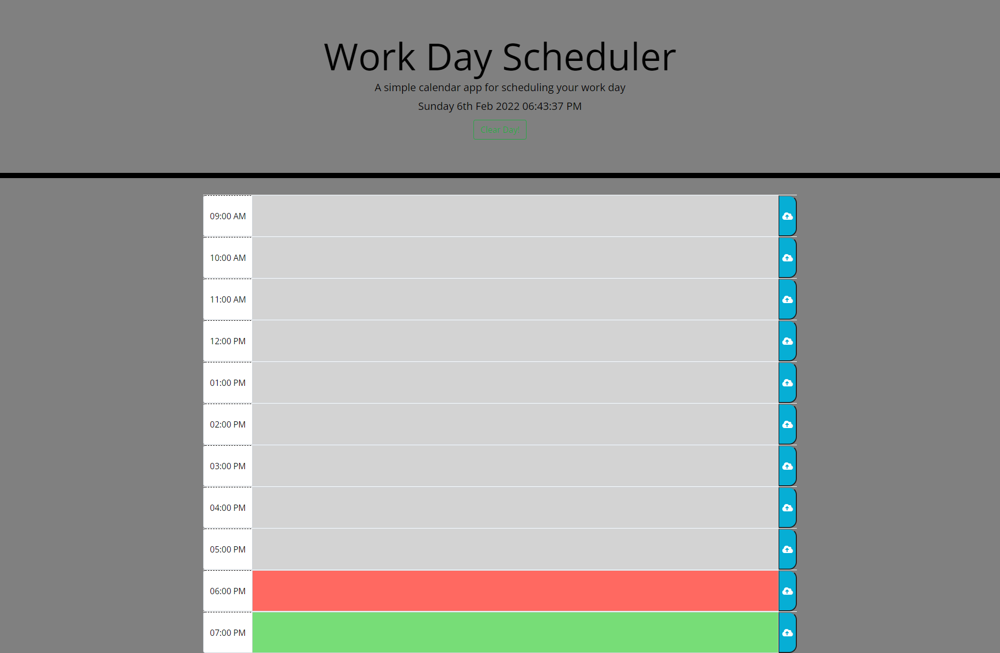

         _    _            _          ______                   _____      _              _       _           
        | |  | |          | |         |  _  \                 /  ___|    | |            | |     | |          
        | |  | | ___  _ __| | ________| | | |__ _ _   _ ______\ `--.  ___| |__   ___  __| |_   _| | ___ _ __ 
        | |/\| |/ _ \| '__| |/ /______| | | / _` | | | |______|`--. \/ __| '_ \ / _ \/ _` | | | | |/ _ \ '__|
        \  /\  / (_) | |  |   <       | |/ / (_| | |_| |      /\__/ / (__| | | |  __/ (_| | |_| | |  __/ |   
         \/  \/ \___/|_|  |_|\_\      |___/ \__,_|\__, |      \____/ \___|_| |_|\___|\__,_|\__,_|_|\___|_|   
                                                   __/ |                                                     
                                                  |___/                                                      
## Description
Web App Designed to help the user track tasks for their day on a per hour basis. User also has the ability to save their tasks to the localstorage and come back at a later time and see which ones they're missing to accomplish. User can clear the tasks so they visit the following day and fill out with new tasks.

Starter code was provided but additions of HTML, CSS & JS were needed in order to get full functionality out of website.

## Usage & Screenshot
Deployed Web Application: [Work-Day-Scheduler](https://miguelmulet.github.io/Work-Day-Scheduler/)

Screenshot:

